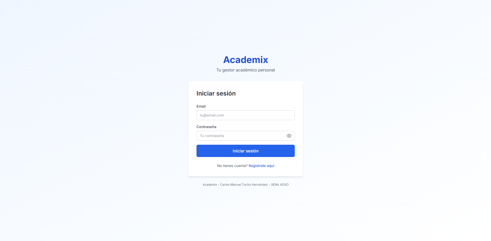
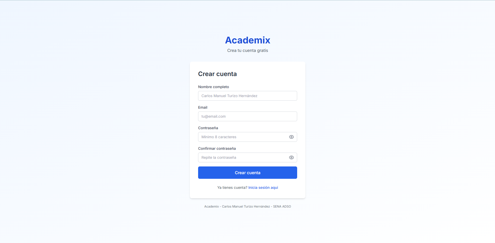
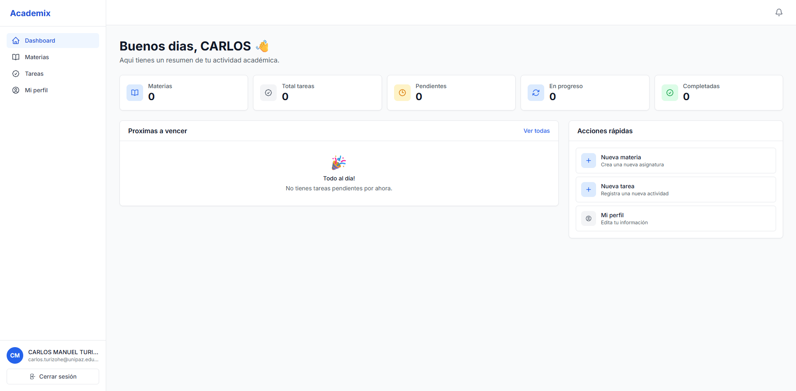
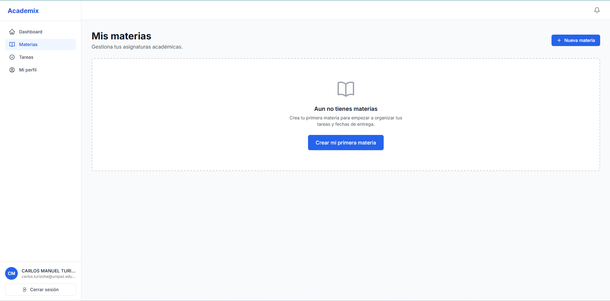
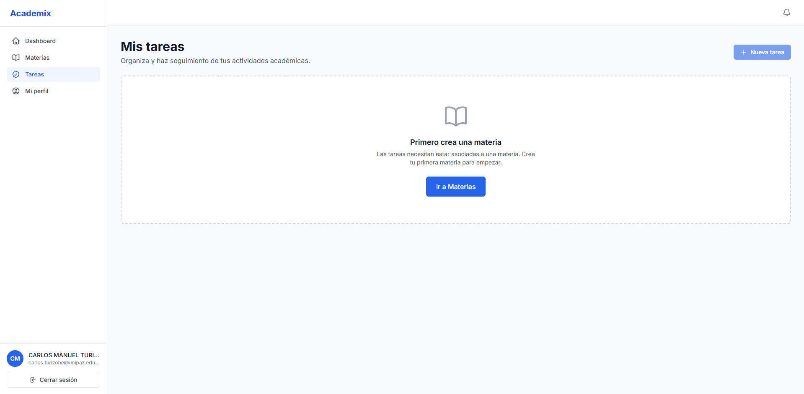
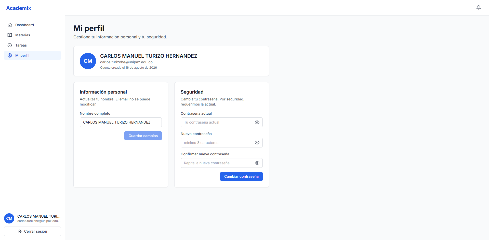
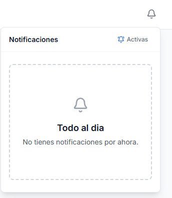
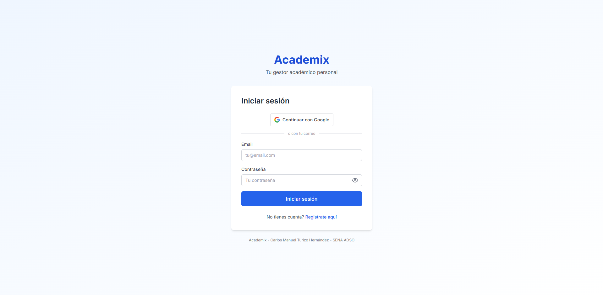
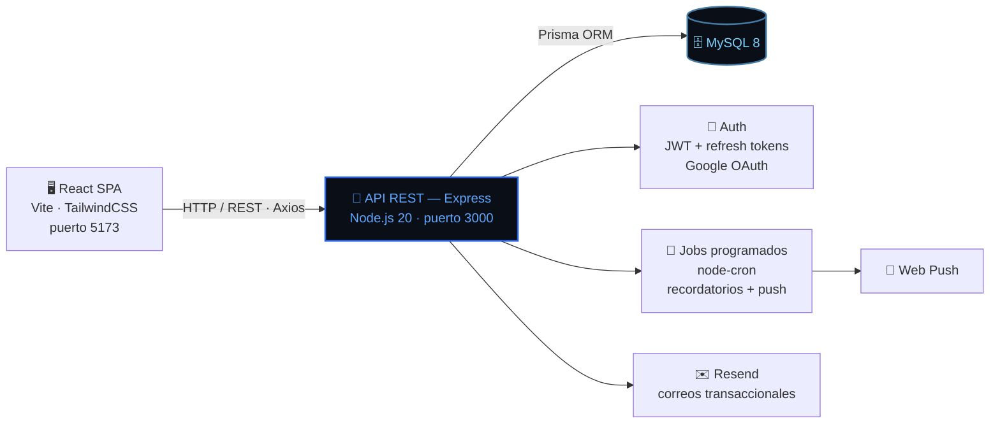

<div align="center">


<a href="https://academix.elmundodemanu.com/">
  
</a>

<br/><br/>


<br/>


<br/><br/>


**Desarrollado por Carlos Manuel Turizo Hernández**
*Tecnólogo en Análisis y Desarrollo de Software — SENA*
*Barrancabermeja, Santander — Colombia 🇨🇴*

</div>

<br/>

> ⚠️ **Proyecto personal — todos los derechos reservados.** Academix es mi proyecto de software insignia durante el Tecnólogo en Análisis y Desarrollo de Software del SENA. El código se comparte aquí con fines de portafolio y evaluación académica; **no está autorizado su uso, copia, redistribución ni despliegue por terceros para fines personales o comerciales.** Ver la sección [Licencia](#-licencia) para el detalle completo.

## 📌 Tabla de contenidos

<details>
<summary>Click para expandir</summary>

- [¿Qué es Academix?](#-qué-es-academix)
- [Capturas de pantalla](#-capturas-de-pantalla)
- [Funcionalidades](#-funcionalidades)
- [Stack tecnológico](#-stack-tecnológico)
- [Arquitectura](#-arquitectura)
- [Modelo de datos](#-modelo-de-datos)
- [Estructura del repositorio](#-estructura-del-repositorio)
- [Puesta en marcha](#-puesta-en-marcha)
- [Despliegue](#-despliegue)
- [Roadmap](#-roadmap)
- [Licencia](#-licencia)
- [Autor](#-autor)

</details>

---

## 📖 ¿Qué es Academix?

**Academix** es una aplicación web full stack que ayuda a organizar la vida académica en un solo lugar: materias, tareas, prioridades, estados y fechas de vencimiento, todo detrás de autenticación segura y con una interfaz moderna, responsive y pensada para usarse todos los días del semestre.

No es un ejercicio de clase aislado — es la herramienta que uso yo mismo para llevar mis propias materias mientras curso el Tecnólogo, y por eso está construida con el mismo cuidado de arquitectura, seguridad y experiencia de usuario que le pondría a un proyecto de producción real.

> 🔗 **Entrá a la app:** [academix.elmundodemanu.com](https://academix.elmundodemanu.com/)

## 🖼️ Capturas de pantalla

<div align="center">

| Inicio de sesión | Crear cuenta |
|:---:|:---:|
|  |  |

| Dashboard | Mis materias |
|:---:|:---:|
|  |  |

| Mis tareas | Mi perfil |
|:---:|:---:|
|  |  |

| Notificaciones | Inicio de sesión con Google |
|:---:|:---:|
|  |  |

</div>

## ✨ Funcionalidades

| | Funcionalidad | Detalle |
|---|---|---|
| 🔐 | **Autenticación segura** | Registro, login, refresh tokens (JWT) e inicio de sesión con **Google OAuth**. |
| 📚 | **Gestión de materias** | Creación y organización de asignaturas con colores personalizados. |
| 📄 | **Detalle de materia** | Página propia por materia: progreso, sus tareas y **apuntes** (notas libres). |
| ✅ | **Gestión de tareas** | Título, descripción, fecha límite y prioridad (Baja / Media / Alta). |
| ☑️ | **Subtareas (checklist)** | Divide una entrega grande en pasos concretos y marca su avance. |
| 🔁 | **Repetir tarea** | Crea varias entregas de una vez (semanal, quincenal o mensual). |
| 🔄 | **Estados de tareas** | Pendiente, En progreso y Completada, con cambio rápido en un clic. |
| 🔍 | **Buscar, filtrar y ordenar** | Búsqueda por texto, filtros combinables y orden por fecha / prioridad. |
| 🗓️ | **Calendario semanal** | Vista lunes-domingo con **arrastrar y soltar** para reprogramar. |
| 📆 | **Exportar a calendario** | Descarga tus entregas como `.ics` para Google Calendar / Apple. |
| ⚠️ | **Alertas de urgencia** | Indicadores visuales para tareas vencidas, que vencen hoy o mañana. |
| 🔔 | **Recordatorios y notificaciones push** | Avisos automáticos antes del vencimiento de una tarea. |
| 📊 | **Dashboard** | Tareas urgentes por umbrales, progreso por materia y filtro rápido. |
| 📈 | **Estadísticas** | Tasa de cumplimiento, racha sin entregas vencidas y ranking de materias. |
| ⌨️ | **Buscador global** | `Ctrl/Cmd + K` para saltar a cualquier materia, tarea o sección. |
| 🌗 | **Modo oscuro** | Tema claro / oscuro / según el sistema, recordado entre visitas. |
| 📲 | **PWA instalable** | "Añadir a la pantalla de inicio" y consulta offline de lo ya cargado. |
| 👤 | **Perfil de usuario** | Edición de datos personales y cambio seguro de contraseña. |
| 📱 | **Diseño responsive** | Adaptado a móvil, tablet y escritorio. |

## 🛠️ Stack tecnológico

<div align="center">

### Frontend

| Tecnología | Propósito |
|---|---|
| React 18 + TypeScript | Interfaz de usuario con tipado estático |
| Vite 6 | Servidor de desarrollo y build optimizado |
| TailwindCSS 3 | Estilos utility-first |
| React Router 7 | Enrutamiento SPA |
| TanStack Query 5 | Gestión de estado del servidor y caché |
| Axios | Cliente HTTP con interceptores |
| vite-plugin-pwa + Workbox | Service worker, manifest y caché offline |
| Vitest + Testing Library | Tests unitarios y de componentes |

### Backend

| Tecnología | Propósito |
|---|---|
| Node.js 20 + TypeScript | Entorno de ejecución y tipado del API |
| Express 4 | Framework de la API REST |
| Prisma ORM | Acceso a datos y migraciones |
| MySQL 8 | Persistencia relacional |
| JWT + bcrypt | Autenticación y hash de contraseñas |
| Google Auth Library | Inicio de sesión con Google |
| Zod | Validación de esquemas (DTOs) |
| Helmet + express-rate-limit | Cabeceras de seguridad y límite de peticiones |
| web-push + node-cron | Notificaciones push y recordatorios programados |
| Resend | Envío de correos transaccionales |
| Vitest + supertest | Tests de utilidades, DTOs (Zod) e integración HTTP |
| GitHub Actions | CI: build + tests en cada push y Pull Request |

</div>

## 🏗️ Arquitectura



El frontend se comunica con el backend exclusivamente a través de la API REST (`/api/v1/auth`, `/materias`, `/tareas`, `/usuarios`, `/notificaciones`). La autenticación combina **JWT + refresh tokens** con **Google OAuth**, lo que permite sesiones persistentes y seguras sin sacrificar la opción de acceso rápido con una cuenta de Google.

## 🗃️ Modelo de datos

Entidades principales gestionadas con Prisma sobre MySQL:

| Entidad | Responsabilidad |
|---|---|
| `Usuario` | Cuenta, credenciales y datos de perfil |
| `Materia` | Asignaturas del usuario, con color personalizado |
| `Nota` | Apuntes libres asociados a una materia |
| `Tarea` | Actividades asociadas a una materia: prioridad, estado, fecha límite |
| `Subtarea` | Pasos del checklist de una tarea (hecho / no hecho) |
| `Recordatorio` | Programación de avisos previos al vencimiento de una tarea |
| `PushSubscription` | Suscripciones del navegador para notificaciones push |

## 📂 Estructura del repositorio

```
academix/
├── frontend/                # SPA con React + TypeScript
│   ├── src/
│   │   ├── pages/            # Login, Registro, Dashboard, Materias, Tareas, Perfil...
│   │   ├── components/       # auth, dashboard, layout, materias, perfil, tareas, ui
│   │   ├── context/           # Contextos globales (auth, etc.)
│   │   ├── hooks/              # Hooks reutilizables
│   │   ├── api/                 # Cliente Axios y llamadas al backend
│   │   └── types/                # Tipado compartido del dominio
│   └── README.md              # Documentación específica del frontend
├── backend/                  # API REST con Node.js + Express + Prisma
│   ├── src/
│   │   ├── modules/            # auth, users, subjects, tasks, reminders, push
│   │   ├── middlewares/         # Autenticación, validación, seguridad
│   │   ├── config/               # Configuración de entorno y servicios
│   │   └── utils/                  # Utilidades compartidas
│   ├── prisma/
│   │   └── schema.prisma          # Modelo de datos y migraciones
│   └── README.md               # Documentación específica del backend
└── README.md                 # ← Estás aquí
```

## 🚀 Puesta en marcha

### Prerrequisitos

- Node.js 20 o superior
- npm o yarn
- Instancia de MySQL 8 configurada

### 1. Clonar el repositorio

```bash
git clone https://github.com/Manu270422/academix.git
cd academix
```

### 2. Configurar y arrancar el backend

```bash
cd backend
npm install
cp .env.example .env   # Completá las variables de entorno (DB, JWT, Google OAuth, etc.)
npm run dev
```

El backend corre en `http://localhost:3000`.

### 3. Configurar y arrancar el frontend

```bash
cd ../frontend
npm install
cp .env.example .env   # VITE_API_URL=http://localhost:3000/api/v1
npm run dev
```

La aplicación queda disponible en `http://localhost:5173` 🎉

> Documentación detallada de cada capa en los README de [`/frontend`](./frontend/README.md) y [`/backend`](./backend/README.md).

## 🌍 Despliegue

Academix corre en producción en [academix.elmundodemanu.com](https://academix.elmundodemanu.com/), con el frontend y el backend desplegados por separado y una base de datos MySQL administrada. El backend expone migraciones vía Prisma (`prisma migrate deploy`) para mantener el esquema sincronizado en cada release.

## 🗺️ Roadmap

**v1.0 — Base**
- ✅ Autenticación completa (registro, login, refresh tokens, Google OAuth)
- ✅ CRUD de materias con colores personalizados
- ✅ CRUD de tareas con prioridades, estados y fechas
- ✅ Recordatorios y notificaciones push
- ✅ Dashboard con estadísticas en tiempo real
- ✅ Diseño responsive (móvil, tablet, escritorio)

**v1.1 — Experiencia del estudiante** ✅
- ✅ Modo oscuro (claro / oscuro / sistema)
- ✅ Calendario semanal con arrastrar y soltar
- ✅ Detalle de materia con progreso y apuntes (notas)
- ✅ Subtareas (checklist) y repetir tarea
- ✅ Buscar, filtrar y ordenar tareas · buscador global `Ctrl/Cmd + K`
- ✅ Exportar entregas a `.ics`
- ✅ Página de estadísticas (cumplimiento, racha, ranking)
- ✅ PWA instalable con consulta offline
- ✅ Suite de tests (Vitest) + CI en GitHub Actions

**v1.2 — Próximamente**
- [ ] Papelera / borrado suave (recuperar materias y tareas eliminadas)
- [ ] Exportar todos mis datos y eliminar cuenta
- [ ] Estadísticas avanzadas con gráficos

## 📄 Licencia

**© Carlos Manuel Turizo Hernández. Todos los derechos reservados.**

Este es un proyecto **personal y formativo**, desarrollado como pieza central de mi paso por el programa de Análisis y Desarrollo de Software del SENA. El código fuente se publica en este repositorio con **fines exclusivos de portafolio, evaluación académica y consulta**.

**No se autoriza**, sin permiso previo y explícito del autor:

- Usar este software, en todo o en parte, con fines personales, académicos de terceros o comerciales.
- Copiar, redistribuir, sublicenciar o desplegar una instancia propia de esta aplicación o de su código.
- Presentar este proyecto, total o parcialmente, como trabajo propio.

Si te interesa este proyecto para fines de aprendizaje o colaboración, escribime — con gusto lo conversamos.

## 👤 Autor

<div align="center">

**Carlos Manuel Turizo Hernández** — *Manu*

Tecnólogo en Análisis y Desarrollo de Software (SENA) · Ingeniería Informática (UNIPAZ)
Barrancabermeja, Santander — Colombia 🇨🇴

<a href="https://elmundodemanu.com"></a>
<a href="https://github.com/Manu270422"></a>
<a href="https://linkedin.com/in/carlos-manuel-turizo-hernández"></a>

</div>

<br/>

