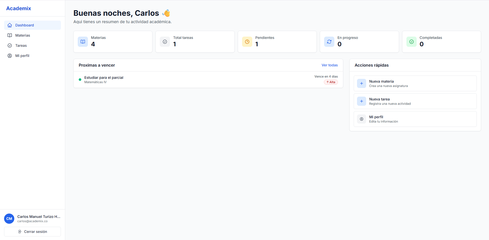
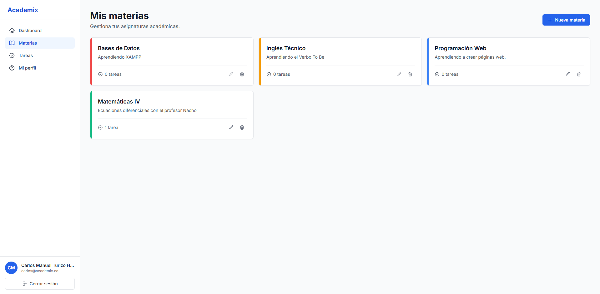
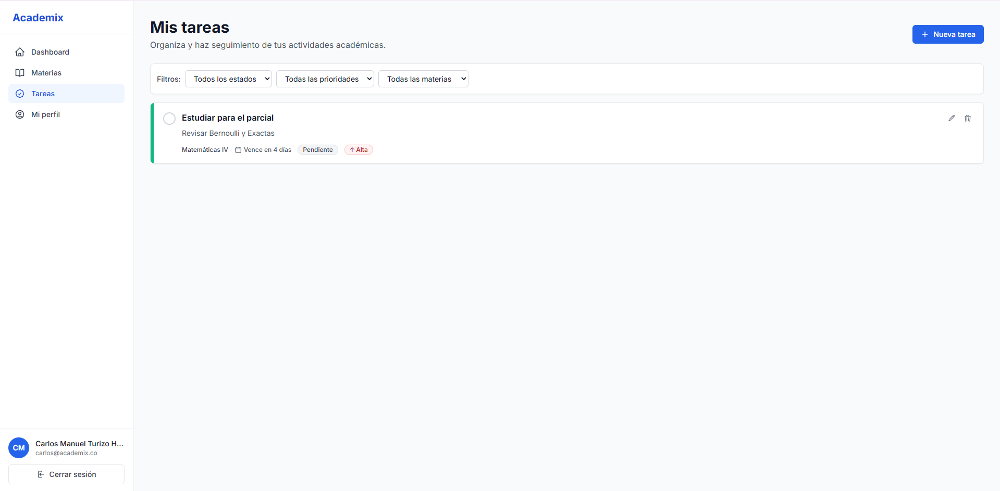
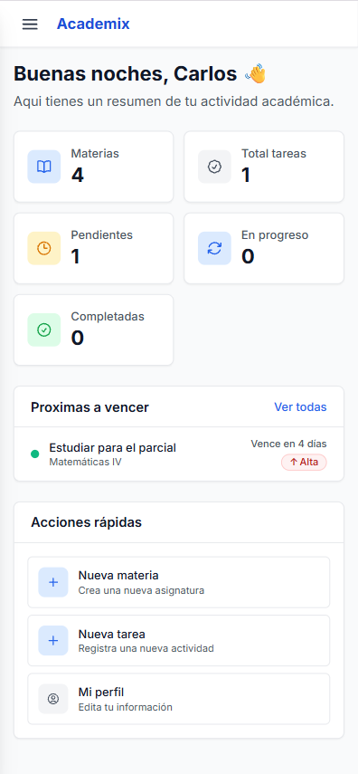

<div align="center">

# 🎓 Academix — Frontend

### Interfaz Web para Sistema de Gestión Académica

[](https://reactjs.org/)
[](https://www.typescriptlang.org/)
[](https://vitejs.dev/)
[](https://tailwindcss.com/)
[](https://tanstack.com/query)

**Desarrollado por Carlos Manuel Turizo Hernández**  
*Tecnólogo en Análisis y Desarrollo de Software — SENA · Barrancabermeja, Colombia 🇨🇴*

[Ver características](#-características-principales) · [Instalación rápida](#-instalación) · [Estructura del proyecto](#-estructura-del-proyecto) · [Despliegue](#-despliegue)

</div>

---

## 📋 Tabla de Contenidos

- [Sobre el Proyecto](#-sobre-el-proyecto)
- [Características Principales](#-características-principales)
- [Stack Tecnológico](#-stack-tecnológico)
- [Diseño y UX](#-diseño-y-ux)
- [Instalación](#-instalación)
- [Variables de Entorno](#-variables-de-entorno)
- [Scripts Disponibles](#-scripts-disponibles)
- [Estructura del Proyecto](#-estructura-del-proyecto)
- [Componentes Principales](#-componentes-principales)
- [Gestión de Estado](#-gestión-de-estado)
- [Despliegue](#-despliegue)
- [Capturas de Pantalla](#-capturas-de-pantalla)
- [Roadmap](#-roadmap)
- [Contribución](#-contribución)
- [Licencia](#-licencia)
- [Contacto](#-contacto)

---

## 🎯 Sobre el Proyecto

**Academix Frontend** es una *Single Page Application (SPA)* construida con React y TypeScript que proporciona una interfaz moderna, intuitiva y completamente responsive para que los estudiantes gestionen sus materias y tareas académicas de forma eficiente.

### ¿Qué hace especial a Academix?

| | |
|---|---|
| 🎨 **Diseño profesional** | Sistema de estilos coherente con TailwindCSS |
| 📱 **Totalmente responsive** | Adaptado para móvil, tablet y escritorio |
| ⚡ **Alto rendimiento** | Build ultrarrápido gracias a Vite |
| 🔄 **Sincronización en tiempo real** | Cache inteligente con TanStack Query |
| 🎭 **Microinteracciones** | Animaciones y transiciones cuidadas en cada acción |
| 🌗 **Modo oscuro** | Tema claro / oscuro / según el sistema |
| 📲 **PWA** | Instalable y con consulta offline (service worker + manifest) |
| 🧪 **Con tests** | Suite de Vitest + Testing Library, ejecutada en CI |

---

## ✨ Características Principales

### 🔐 Autenticación
- Registro de usuarios con validación en tiempo real
- Inicio de sesión seguro con refresh tokens automático
- Persistencia de sesión entre recargas
- Protección de rutas privadas

### 📚 Gestión de Materias
- Crear materias con paleta de 10 colores curados
- Editar y eliminar con confirmación antes de acciones destructivas
- Visualización en cards con contador de tareas por materia

### ✅ Gestión de Tareas
- Crear tareas con título, descripción, fecha límite y nivel de prioridad
- Tres estados: `Pendiente` · `En Progreso` · `Completada`
- Tres niveles de prioridad: `Baja` · `Media` · `Alta`
- Cambio rápido de estado con un click (checkbox animado)
- Filtros combinables por estado, prioridad y materia
- Indicadores visuales de urgencia: vencidas, vence hoy, vence mañana
- Formato de fechas inteligente ("Vence en 3 días")
- Ordenamiento automático por urgencia

### ☑️ Subtareas y recurrencia
- Checklist por tarea: divide una entrega en pasos y marca su avance
- Repetir tarea al crearla: semanal, quincenal o mensual (crea N tareas de una vez)

### 🗓️ Calendario semanal
- Vista lunes–domingo con las tareas repartidas por día y hora
- **Arrastrar y soltar** una tarea a otro día para reprogramarla (conserva la hora)
- Botón `+` por día para crear una tarea con la fecha ya puesta
- Exportar la semana (o la lista filtrada) a un archivo `.ics`

### 📄 Detalle de materia
- Página propia por materia (`/materias/:id`): barra de progreso y sus tareas
- **Apuntes**: notas libres por materia, con edición en línea

### 📊 Dashboard y estadísticas
- Tareas urgentes agrupadas por umbral (6 h / 24 h / 72 h) con filtro rápido
- Progreso por materia y alerta de tareas vencidas
- Página de estadísticas: tasa de cumplimiento, racha sin entregas vencidas,
  cumplimiento de las últimas 8 semanas y ranking de materias

### ⌨️ Buscador global
- `Ctrl / Cmd + K` abre un buscador para saltar a cualquier materia, tarea o sección
- Navegación con teclado (↑ ↓ Enter), búsqueda insensible a tildes

### 🌗 Modo oscuro
- Tres modos: claro, oscuro o "según el sistema"
- Se recuerda entre visitas y se aplica sin parpadeo al cargar

### 📲 PWA (instalable + offline)
- "Añadir a la pantalla de inicio" en móvil y escritorio
- Service worker (vite-plugin-pwa + Workbox) con caché *network-first* de la API:
  si no hay conexión, muestra lo último cargado
- Convive con el service worker de notificaciones push existente

### 👤 Perfil de Usuario
- Edición de nombre y datos personales
- Cambio seguro de contraseña
- Avatar generado automáticamente con iniciales
- **Descargar mis datos** en un `.json` (portabilidad / respaldo)
- **Eliminar mi cuenta** con doble confirmación (irreversible)

---

## 🛠️ Stack Tecnológico

| Tecnología | Versión | Propósito |
|------------|:-------:|-----------|
| **React** | 18.3 | Librería principal de UI |
| **TypeScript** | 5.6 | Tipado estático y seguridad en tiempo de desarrollo |
| **Vite** | 6.0 | Build tool con HMR instantáneo |
| **TailwindCSS** | 3.4 | Framework de estilos utility-first |
| **React Router** | 7.0 | Enrutamiento SPA |
| **TanStack Query** | 5.62 | Gestión de estado del servidor y cache |
| **Axios** | 1.7 | Cliente HTTP con interceptores |
| **Lucide React** | latest | Librería de iconos modernos |
| **vite-plugin-pwa** | 1.3 | Service worker, manifest y caché offline (Workbox) |
| **Vitest** | 2 | Runner de tests |
| **Testing Library** | latest | Tests de componentes React |

### Decisiones de arquitectura

**React + TypeScript** — Estándar de la industria para aplicaciones escalables. El tipado estricto reduce errores en tiempo de ejecución y mejora la experiencia de desarrollo.

**Vite** — Reemplazo moderno de Create React App. Ofrece Hot Module Replacement instantáneo y builds optimizados listos para producción.

**TailwindCSS** — Permite desarrollo rápido sin cambiar de contexto. La consistencia visual se logra por convención, sin necesidad de CSS personalizado.

**TanStack Query** — Cache inteligente, refetch automático y sincronización entre pestañas. Elimina cientos de líneas de código boilerplate para manejo de estado asíncrono.

**Axios con interceptores** — Manejo centralizado de tokens, renovación automática de sesión y gestión de errores HTTP desde un único punto.

---

## 🎨 Diseño y UX

### Sistema de Colores para Materias

```javascript
// Paleta curada de 10 colores para personalizar materias
const COLORES_MATERIAS = [
  { nombre: 'Azul',     hex: '#3B82F6' },
  { nombre: 'Verde',    hex: '#10B981' },
  { nombre: 'Amarillo', hex: '#F59E0B' },
  { nombre: 'Rojo',     hex: '#EF4444' },
  { nombre: 'Púrpura',  hex: '#8B5CF6' },
  { nombre: 'Rosa',     hex: '#EC4899' },
  { nombre: 'Turquesa', hex: '#14B8A6' },
  { nombre: 'Naranja',  hex: '#F97316' },
  { nombre: 'Índigo',   hex: '#6366F1' },
  { nombre: 'Gris',     hex: '#6B7280' },
];
```

### Responsive Design

| Breakpoint | Rango | Comportamiento |
|---|---|---|
| 📱 **Móvil** | `< 768px` | Sidebar oculta · Menú hamburguesa · Grid 1 columna · Overlay oscuro al abrir |
| 📊 **Tablet** | `768px – 1024px` | Sidebar deslizable · Grid 2 columnas · Espaciado optimizado |
| 🖥️ **Desktop** | `> 1024px` | Sidebar fija lateral · Grid 3 columnas · Máxima densidad de información |

### Microinteracciones

- Animaciones suaves de entrada/salida en modales
- Hover states consistentes en todos los elementos interactivos
- Skeleton screens durante la carga de datos
- Feedback visual inmediato en checkboxes y botones
- Transiciones de color al cambiar el estado de una tarea

---

## 🚀 Instalación

### Prerrequisitos

- [Node.js](https://nodejs.org/) v20 o superior
- `npm` o `yarn`
- Backend de Academix corriendo localmente o en un servidor

### Pasos

**1. Clonar el repositorio**

```bash
git clone https://github.com/Manu270422/academix-frontend.git
cd academix-frontend
```

**2. Instalar dependencias**

```bash
npm install
```

**3. Configurar variables de entorno**

```bash
cp .env.example .env
```

Edita el archivo `.env` con la URL de tu backend:

```env
VITE_API_URL=http://localhost:3000/api/v1
```

**4. Iniciar el servidor de desarrollo**

```bash
npm run dev
```

La aplicación estará disponible en `http://localhost:5173` 🎉

**5. Build para producción** *(opcional)*

```bash
npm run build
npm run preview   # Previsualiza el build localmente
```

---

## 🔑 Variables de Entorno

| Variable | Descripción | Valor de ejemplo |
|----------|-------------|-----------------|
| `VITE_API_URL` | URL base de la API backend | `http://localhost:3000/api/v1` |

> **⚠️ Importante:** En Vite, todas las variables de entorno expuestas al cliente **deben comenzar con `VITE_`**. Variables sin este prefijo no estarán disponibles en el navegador.

---

## 📜 Scripts Disponibles

```bash
# Desarrollo
npm run dev           # Inicia el servidor de desarrollo en el puerto 5173

# Producción
npm run build         # Compila el proyecto (salida en /dist)
npm run preview       # Sirve el build localmente para revisión

# Calidad de código
npm run lint          # Ejecuta ESLint sobre el proyecto
npm run type-check    # Verifica tipos con el compilador de TypeScript

# Tests
npm test              # Ejecuta la suite de Vitest una vez
npm run test:watch    # Vitest en modo watch
```

---

## 📁 Estructura del Proyecto

```
frontend/
├── public/
│   └── vite.svg                    # Favicon
├── src/
│   ├── api/
│   │   ├── client.ts               # Cliente Axios con interceptores de auth
│   │   ├── auth.service.ts         # Servicios de autenticación
│   │   ├── subjects.service.ts     # Servicios de materias
│   │   └── tasks.service.ts        # Servicios de tareas
│   ├── components/
│   │   ├── ui/                     # Componentes base reutilizables
│   │   │   ├── Input.tsx
│   │   │   ├── Button.tsx
│   │   │   ├── Modal.tsx
│   │   │   ├── Alert.tsx
│   │   │   ├── ConfirmDialog.tsx
│   │   │   └── EmptyState.tsx
│   │   ├── layout/                 # Estructura y navegación de la app
│   │   │   ├── AppLayout.tsx
│   │   │   ├── Sidebar.tsx
│   │   │   └── MobileHeader.tsx
│   │   ├── materias/
│   │   │   ├── MateriaCard.tsx
│   │   │   ├── MateriaForm.tsx
│   │   │   └── ColorPicker.tsx
│   │   ├── tareas/
│   │   │   ├── TareaCard.tsx
│   │   │   ├── TareaForm.tsx
│   │   │   ├── TareaFiltros.tsx
│   │   │   ├── EstadoBadge.tsx
│   │   │   └── PrioridadBadge.tsx
│   │   ├── perfil/
│   │   │   ├── InformacionPersonal.tsx
│   │   │   └── CambioPassword.tsx
│   │   └── dashboard/
│   │       ├── EstadisticasCard.tsx
│   │       └── ProximasTareas.tsx
│   ├── context/
│   │   ├── AuthContext.tsx         # Provider de autenticación global
│   │   └── AuthContext.ts          # Tipos y definición del contexto
│   ├── hooks/
│   │   ├── useAuth.ts              # Hook de autenticación
│   │   ├── useForm.ts              # Hook genérico para formularios con validación
│   │   ├── useMaterias.ts          # Hooks de TanStack Query para materias
│   │   └── useTareas.ts            # Hooks de TanStack Query para tareas
│   ├── pages/
│   │   ├── Login.tsx
│   │   ├── Register.tsx
│   │   ├── Dashboard.tsx
│   │   ├── Materias.tsx
│   │   ├── Tareas.tsx
│   │   └── Perfil.tsx
│   ├── types/
│   │   └── index.ts                # Tipos compartidos: Usuario, Materia, Tarea
│   ├── utils/
│   │   └── fechas.ts               # Utilidades de formateo y cálculo de fechas
│   ├── App.tsx                     # Definición de rutas principales
│   ├── main.tsx                    # Entry point de la aplicación
│   └── index.css                   # Estilos globales + directivas de Tailwind
├── .env.example                    # Plantilla de variables de entorno
├── .gitignore
├── index.html
├── package.json
├── tailwind.config.js
├── tsconfig.json
├── vite.config.ts
└── README.md
```

---

## 🧩 Componentes Principales

### Componentes UI Base (`/components/ui`)

```tsx
// Input con label integrado, manejo de errores y toggle de contraseña
<Input
  label="Contraseña"
  type="password"
  value={password}
  onChange={(e) => setPassword(e.target.value)}
  error={errors.password}
/>

// Button con variantes de estilo y estado de carga
<Button
  variant="primary"
  size="lg"
  isLoading={isSubmitting}
  onClick={handleSubmit}
>
  Guardar
</Button>

// Modal con overlay y animaciones de entrada/salida
<Modal isOpen={isOpen} onClose={handleClose} title="Crear Materia">
  <MateriaForm onSuccess={handleClose} />
</Modal>
```

### Layout (`/components/layout`)

```tsx
// Sidebar responsive con estado de apertura controlado externamente
<Sidebar isOpen={isSidebarOpen} onClose={() => setIsSidebarOpen(false)} />

// Layout que envuelve todas las páginas protegidas
<AppLayout>
  <Outlet /> {/* Rutas internas renderizadas aquí */}
</AppLayout>
```

### Hooks Personalizados

```typescript
// Autenticación global
const { user, login, logout, isAuthenticated } = useAuth();

// Formularios con validación declarativa
const { values, errors, handleChange, handleSubmit, isSubmitting } = useForm({
  initialValues,
  validationRules,
  onSubmit,
});

// Queries y mutations con TanStack Query
const { data: materias, isLoading } = useMateriasList();
const createMateria = useCreateMateria();
const updateTarea = useUpdateTarea();
```

---

## 🔄 Gestión de Estado

### TanStack Query — Estado del servidor

Todas las peticiones HTTP se gestionan con TanStack Query, lo que garantiza cache automático, refetch inteligente y sincronización entre pestañas:

```typescript
// Query con filtros reactivos
const { data: tareas, isLoading, error } = useTareasList({
  estado: filtroEstado,
  prioridad: filtroPrioridad,
});

// Mutation con invalidación automática de cache
const updateTareaStatus = useUpdateTareaStatus();

const handleToggleEstado = async (tareaId: number) => {
  await updateTareaStatus.mutateAsync({ id: tareaId, estado: nuevoEstado });
  // TanStack Query invalida el cache y refetch automáticamente
};
```

### Context API — Estado global de autenticación

```typescript
const AuthContext = createContext<AuthContextType | undefined>(undefined);

// Providers anidados en App.tsx
<AuthProvider>
  <QueryClientProvider client={queryClient}>
    <RouterProvider router={router} />
  </QueryClientProvider>
</AuthProvider>
```

### useState — Estado local de UI

Para modales, selecciones temporales y otros estados de interfaz:

```typescript
const [isModalOpen, setIsModalOpen] = useState(false);
const [selectedMateria, setSelectedMateria] = useState<Materia | null>(null);
```

---

## 🚢 Despliegue

### Opción 1: Vercel *(Recomendado)*

Vercel está optimizado para proyectos Vite/React y ofrece deploys automáticos desde GitHub.

```bash
npm install -g vercel
vercel
```

Configura la variable de entorno en el dashboard de Vercel:

```
VITE_API_URL = https://tu-backend.render.com/api/v1
```

A partir de ahí, cada push a `main` generará un deploy automático.

### Opción 2: Netlify

```bash
npm install -g netlify-cli
netlify deploy --prod
```

### Opción 3: GitHub Pages

Requiere ajustar la configuración base en `vite.config.ts`:

```typescript
export default defineConfig({
  base: '/nombre-del-repositorio/',
  // resto de la configuración...
});
```

### Cualquier hosting estático

```bash
npm run build
# Sube el contenido de /dist a tu servidor (Hostinger, cPanel, S3, etc.)
```

### Configuración de SPA en Vercel (`vercel.json`)

Este archivo es **obligatorio** para que React Router funcione correctamente al refrescar la página o acceder a una ruta directamente:

```json
{
  "rewrites": [
    { "source": "/(.*)", "destination": "/index.html" }
  ]
}
```

---

## 📸 Capturas de Pantalla

### Dashboard

*Vista principal con estadísticas en tiempo real y tareas próximas a vencer*

### Gestión de Materias

*Grid responsive de materias con paleta de colores personalizable*

### Gestión de Tareas

*Listado de tareas con filtros combinables y badges de estado y prioridad*

### Vista Móvil

*Interfaz completamente adaptada para dispositivos móviles*

---

## 🗺️ Roadmap

### v1.0 — Base ✅
- Autenticación completa con refresh tokens
- CRUD de materias y tareas
- Dashboard con estadísticas en tiempo real
- Filtros avanzados combinables
- Diseño completamente responsive

### v1.1 — Experiencia del estudiante ✅
- [x] Modo oscuro (claro / oscuro / sistema)
- [x] Calendario semanal con drag & drop
- [x] Atajos de teclado y buscador global (`Ctrl/Cmd + K`)
- [x] Buscar, filtrar y ordenar tareas
- [x] Detalle de materia con progreso y apuntes
- [x] Subtareas (checklist) y repetir tarea
- [x] Página de estadísticas (cumplimiento, racha, ranking)
- [x] Exportar entregas a `.ics`
- [x] PWA instalable con consulta offline
- [x] Suite de tests (Vitest) + CI

### v1.2 — En curso
- [x] Exportar todos mis datos (JSON) y eliminar cuenta
- [ ] Papelera / borrado suave (recuperar lo eliminado)
- [ ] Estadísticas avanzadas con gráficos

---

## 🧪 Testing

La suite usa **Vitest** + **Testing Library** (entorno `jsdom`). La configuración
vive en `vitest.config.ts`, separada de `vite.config.ts`.

```bash
npm test              # Ejecuta todos los tests una vez
npm run test:watch    # Modo watch
```

Cubre las utilidades puras (`utils/fechas`, `utils/ics`), componentes de UI y el
buscador global. Se ejecuta automáticamente en cada push y Pull Request mediante
GitHub Actions (`.github/workflows/ci.yml`).

---

## 🤝 Contribución

Este es un proyecto académico del programa ADSO — SENA. Si deseas contribuir:

1. Haz un fork del repositorio
2. Crea una rama descriptiva: `git checkout -b feature/nombre-de-la-mejora`
3. Realiza tus cambios y haz commit: `git commit -m 'feat: descripción clara del cambio'`
4. Sube la rama: `git push origin feature/nombre-de-la-mejora`
5. Abre un Pull Request explicando los cambios realizados

### Estándares de código

- Componentes en `PascalCase`
- Hooks personalizados con prefijo `use`
- Props siempre tipadas con TypeScript
- Comentarios en español
- Estilos exclusivamente con TailwindCSS (sin CSS Modules)

---

## 📄 Licencia

Este proyecto es de uso académico y educativo. Todos los derechos reservados al autor.

---

## 📞 Contacto

**Carlos Manuel Turizo Hernández**  
Tecnólogo en Análisis y Desarrollo de Software — SENA

[](https://github.com/Manu270422/)
[](https://linkedin.com/in/carlos-manuel-turizo-hernández)
[](mailto:carlosmanuel.turizo@gmail.com)

---

<div align="center">

**[⬆ Volver arriba](#-academix--frontend)**

*Construido con React, TypeScript y mucho café ☕*

</div>
